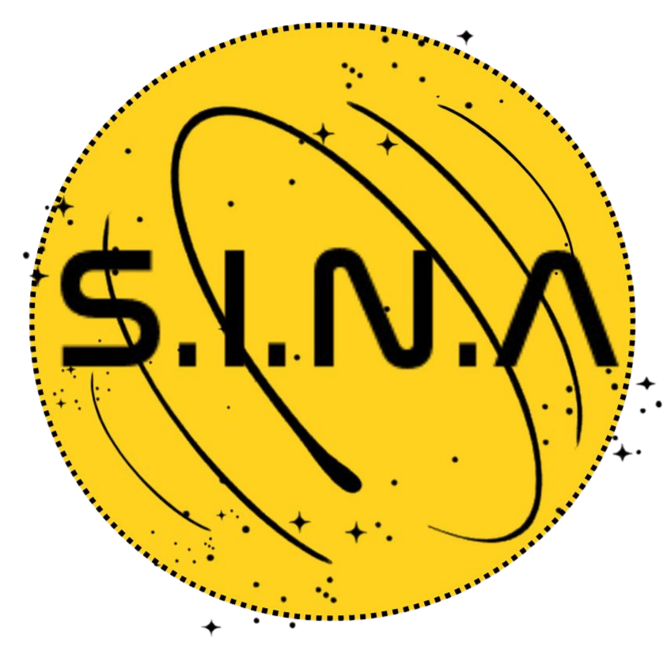

<a id="readme-top"></a>

<div align="center">

  
  
  
  
  

</div>

<br />
<div align="center">
  <a href="https://github.com/Gengiscana/S.I.N.A">
    
  </a>

<h3 align="center">S.I.N.A</h3>

  <p align="center">
    <strong>Sistema Integrado de Aprendizagem Ativa</strong>
    <br />
    Engajamento educacional via visão computacional integrado ao ecossistema SESI.
    <br />
    <br />
    <a href="https://github.com/Gengiscana/S.I.N.A">Explorar Docs</a>
    ·
    <a href="https://github.com/Gengiscana/S.I.N.A/issues">Reportar Bug</a>
    ·
    <a href="https://github.com/Gengiscana/S.I.N.A/issues">Sugestões</a>
  </p>
</div>

<details>
  <summary>Sumário</summary>
  <ol>
    <li>
      <a href="#sobre-o-projeto">Sobre o Projeto</a>
      <ul>
        <li><a href="#tecnologias-utilizadas">Tecnologias Utilizadas</a></li>
      </ul>
    </li>
    <li>
      <a href="#primeiros-passos">Primeiros Passos</a>
      <ul>
        <li><a href="#pré-requisitos">Pré-requisitos</a></li>
        <li><a href="#instalação">Instalação</a></li>
      </ul>
    </li>
    <li><a href="#funcionalidades">Funcionalidades</a></li>
    <li><a href="#requisitos-não-funcionais">Requisitos Não Funcionais</a></li>
    <li><a href="#roadmap">Roadmap</a></li>
    <li><a href="#contribuição">Contato</a></li>
  </ol>
</details>

## Sobre o Projeto

O **S.I.N.A** é um ecossistema desenvolvido para transformar a dinâmica de sala de aula. Através de uma câmera acoplada a um tripé e cartões físicos de MDF (produzidos via corte a laser), o sistema escaneia as respostas dos alunos simultaneamente utilizando **OpenCV**.

**Por que o S.I.N.A?**
* **Conformidade Legal:** Respeita a proibição de celulares em sala (Lei 15.100/2025).
* **Autonomia:** Utiliza processamento local via **Raspberry Pi** dentro da rede SESI.
* **Gamificação:** Gera rankings automáticos e dashboards no **Power BI** para visualização em TVs escolares.


### Tecnologias Utilizadas

<div align="left">
  
  
  
  
</div>


## Primeiros Passos

### Pré-requisitos
* Python 3.10 ou superior.
* Câmera USB ou módulo de câmera para Raspberry.
* Bibliotecas: `opencv-python` e `numpy`.

### Instalação
1. Clone o repositório:
   ```sh
   git clone [https://github.com/Gengiscana/S.I.N.A.git](https://github.com/Gengiscana/S.I.N.A.git)

## Contribuição

Contribuições para o aprimoramento do projeto será **muito apreciada**, caso queria, siga os passos abaixo:

1. Faça um Fork do projeto
2. Crie sua Feature Branch (`git checkout -b feature/coisabiglegal`)
3. Commite suas mudanças (`git commit -m 'Add some coisabiglegal'`)
4. Faça o Push para a Branch (`git push origin feature/coisamuitolegal`)
5. Abra um Pull Request

### Desenvolvedores

<a href="https://github.com/Gengiscana/S.I.N.A/graphs/contributors">
  
</a>

<p align="right"><a href="#readme-top">voltar ao topo ↺</a></p>
